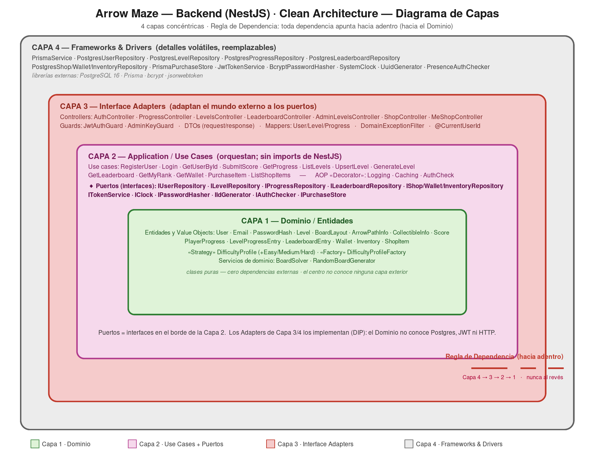

# Arrow Maze — Backend API


REST API for **Arrow Maze**, a mobile arrow-routing puzzle game. Handles authentication, the level catalog (hand-crafted + procedurally generated boards), player progress, per-level leaderboards, and an in-game shop with an atomic purchase flow.

Serves the [`arrow-maze-app`](https://github.com/faleon24/arrow-maze-app) Flutter client.

---

## Architecture

Hexagonal + Domain-Driven Design. Four layers with a strict inward dependency rule; the domain has zero framework imports.



```
src/
  domain/                         # pure business core — no NestJS, no Prisma
    models/                       # entities + value objects + GoF patterns
    services/                     # board solver, procedural generator
    errors/                       # typed domain errors
  application/                    # use cases + ports (framework-agnostic)
    usecases/                     # one folder per feature, *.usecase.ts
    ports/out/                    # outbound port interfaces
    ports/tokens.ts               # DI Symbols
    decorators/                   # cross-cutting Decorators (AOP)
  infrastructure/                 # adapters implementing the ports
    persistence/                  # Prisma/Postgres repositories + mappers
    security/                     # bcrypt hasher, JWT service
    system/                       # clock, uuid generator
  api/                            # NestJS controllers, guards, DTOs (the "web" edge)
```

**Dependency rule:** `api → application → domain` and `infrastructure → application/domain`. Use cases are framework-agnostic (no `@nestjs/common` imports); every outbound dependency is a port injected via a `Symbol` token from [`application/ports/tokens.ts`](src/application/ports/tokens.ts) and wired in `AppModule`. A full class diagram lives at [`docs/class_diagram.png`](docs/class_diagram.png).

---

## Design Patterns (GoF)

Four Gang-of-Four patterns are implemented on the server (the client implements four more — see its README).

| Pattern | Role in this service | Source |
|---|---|---|
| **Factory Method** | `DifficultyProfileFactory` produces the right `DifficultyProfile` (easy/medium/hard) for a requested difficulty, hiding construction from the procedural generator. | [`domain/models/difficulty-profile.factory.ts`](src/domain/models/difficulty-profile.factory.ts) |
| **Strategy** | `DifficultyProfile` is a family of interchangeable algorithms parameterizing board size, path density, and turn bias; the generator selects one at runtime. | [`domain/models/difficulty-profile.ts`](src/domain/models/difficulty-profile.ts) |
| **Decorator** | `LoggingUseCaseDecorator` wraps every use case with structured entry/exit/error logging without touching the use case itself (used instead of forbidden interceptors). | [`application/decorators/logging-use-case.decorator.ts`](src/application/decorators/logging-use-case.decorator.ts) |
| **Adapter** | Each outbound port is realized by an infrastructure adapter: Postgres repositories, bcrypt hasher, JWT service, system clock, UUID generator. | [`infrastructure/persistence/`](src/infrastructure/persistence), [`security/`](src/infrastructure/security), [`system/`](src/infrastructure/system) |

---

## SOLID Principles

Concrete example per principle, each pointing to real code.

- **Single Responsibility** — Every use case is one operation with one reason to change: [`login.usecase.ts`](src/application/usecases/auth/login.usecase.ts) authenticates, [`purchase-item.usecase.ts`](src/application/usecases/purchase/purchase-item.usecase.ts) runs the atomic purchase. Neither knows about HTTP or SQL.
- **Open/Closed** — A new difficulty is added by writing a new `DifficultyProfile` strategy; [`difficulty-profile.factory.ts`](src/domain/models/difficulty-profile.factory.ts) is extended without modifying the generator that consumes it.
- **Liskov Substitution** — Any implementation of a repository port (e.g. the Postgres `postgres-level.repository.ts` or an in-memory test double) is substitutable behind [`level-repository.port.ts`](src/application/ports/out/level-repository.port.ts); the e2e suite swaps real infrastructure for fakes with no use-case changes.
- **Interface Segregation** — Ports are narrow and purpose-built: [`password-hasher.port.ts`](src/application/ports/out/password-hasher.port.ts), [`token-service.port.ts`](src/application/ports/out/token-service.port.ts), and [`clock.port.ts`](src/application/ports/out/clock.port.ts) are separate, so a use case depends only on what it actually calls.
- **Dependency Inversion** — Use cases depend on the port abstractions in [`application/ports/out/`](src/application/ports/out); concrete adapters are bound to `Symbol` tokens in `AppModule` (`{ provide: TOKEN, useClass: Adapter }`), so high-level policy never depends on low-level detail.

---

## AOP — Aspect-Oriented Programming

Cross-cutting concerns are applied with the **Decorator** pattern rather than NestJS interceptors (interceptors are disallowed on this project). Each aspect wraps a use case transparently — same `execute(command)` signature — so business logic stays clean and aspects compose:

| Aspect | Concern | Applied via |
|---|---|---|
| **Logging** | Structured entry / exit / duration / error logging around all 12 use cases | [`LoggingUseCaseDecorator`](src/application/decorators/logging-use-case.decorator.ts) + `withLogging(...)` in `AppModule` |
| **Authorization** | Reject an unauthenticated subject before a protected use case runs (defence-in-depth beside the API guard); wraps `GetProgress` and `GetWallet` | [`AuthCheckUseCaseDecorator`](src/application/decorators/auth-check-use-case.decorator.ts) + `withAuth(...)`, backed by the [`IAuthChecker`](src/application/ports/out/auth-checker.port.ts) port |
| **Caching** | 30s TTL memoisation of the read-only user-profile lookup (`GetUserById`, hit on every authenticated request), keyed by command | [`CachingUseCaseDecorator`](src/application/decorators/caching-use-case.decorator.ts) + `withCache(...)` |

> All three decorators share the same `UseCase<C, R>` contract from [`application/usecases/use-case.ts`](src/application/usecases/use-case.ts), so they stack in any order at composition time (each protected use case is `withLogging(withAuth(...))` or `withLogging(withCache(...))`). Each decorator is unit-tested in isolation with fakes under [`test/application/decorators/`](test/application/decorators).

---

## Features

- **Auth** — register/login issuing JWT, protected routes behind `JwtAuthGuard`
- **Level catalog** — hand-crafted levels forming visual figures + procedural generator v4 (multi-cell serpentine paths, turn bias, reachable collectibles)
- **On-demand generation** — `POST /levels/generate` builds a fresh solvable board
- **Progress + leaderboard** — per-level stars, score submission, ranked boards
- **Shop + economy** — item catalog, coin wallet, inventory, single-transaction atomic purchase (no partial writes)
- **Board solver** — validates every seeded/generated level is solvable before it ships

---

## Getting started

Requires Node 20+, PostgreSQL 16, and npm.

```bash
git clone git@github.com:faleon24/arrow-maze-backend.git
cd arrow-maze-backend
npm install
cp .env.example .env          # set DATABASE_URL + JWT_SECRET
npx prisma migrate deploy
npx prisma db seed            # 3 hand-crafted + procedural levels + shop items
npm run start:dev             # http://localhost:3000/api
```

### API documentation (Swagger)

Interactive OpenAPI docs are served at **`http://localhost:3000/api/docs`** once the server is running.

---

## Running tests

```bash
npm test          # 354 unit tests across 42 suites
npm run test:e2e  # 51 e2e tests across 8 suites
npm run test:cov  # coverage report
```

CI runs unit + e2e on every push and pull request (see [`.github/workflows/ci.yml`](.github/workflows/ci.yml)).

---

## Project conventions

- Hexagonal + DDD; use cases free of framework imports
- Conventional Commits in English; each feature on its own branch, merged with `--no-ff`
- Tests in AAA style with `should_x_when_y` naming
- DI via `Symbol` tokens declared in `application/ports/tokens.ts`
- No enums (whitelisted string constants + validation)
- Cross-cutting concerns via Decorator, never interceptors

---

## AI usage

Development made heavy use of AI assistance, logged transparently with a critical evaluation in [`AI_USAGE.md`](AI_USAGE.md).

## License

MIT — see [`LICENSE`](LICENSE).
